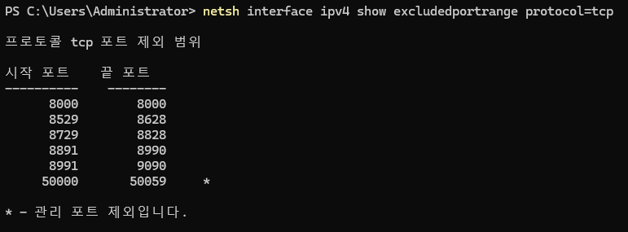
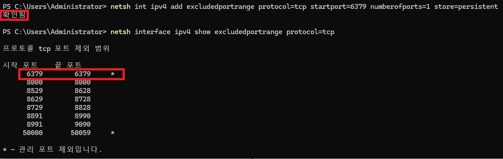

# Docker 컨테이너 Port 접근 권한 오류

## 목차

[문제 상황](#문제-상황)

[문제 원인](#문제-원인)

[문제 해결](#문제-해결)

## 문제 상황

평소처럼 Docker Desktop을 통해 Redis 컨테이너를 실행했는데, 아래와 같은 오류와 함께 Redis 컨테이너가 실행되지 않았습니다.

```
(HTTP code 500) server error - Ports are not available: exposing port TCP 0.0.0.0:6379 -> 0.0.0.0:0: listen tcp 0.0.0.0:6379: bind: An attempt was made to access a socket in a way forbidden by its access permissions.
```

처음에는 오류 문구를 자세히 보지 않고, Port 번호가 이미 사용 중인 오류라고 생각하여 해당 Port를 사용하는 프로세스가 있는지 확인했지만, 해당 Port를 사용하는 프로세스는 없었습니다.

## 문제 원인

Windows PowerShell에서 직접 컨테이너를 실행해 보았지만, 아래와 같은 오류가 발생했습니다.

```
Error response from daemon: Ports are not available: exposing port TCP 0.0.0.0:6379 -> 0.0.0.0:0: listen tcp 0.0.0.0:6379: bind: An attempt was made to access a socket in a way forbidden by its access permissions.
```

해당 오류에서 “permissions”라는 문구를 보고, 권한과 관련된 문제일 가능성을 생각하게 되었고, 구글링을 통해 문제의 원인을 확인했습니다.

문제의 원인은 Windows 운영체제에서 TCP 프로토콜의 제외된 Port 범위에 속하는 Port 번호를 사용하려고 하는 원인이였습니다.

아래 명령어를 통해서 Windows 운영체제에서 현재 시스템이 사용하는 TCP 프로토콜의 제외된 Port 범위를 확인할 수 있습니다.

```
netsh interface ipv4 show excludedportrange protocol=tcp
```



위와 같은 결과를 확인할 수 있으며, 문제 해결 전에는 시작 포트 6313, 끝 포트 6412로 사용하려고 하는 Redis 컨테이너 Port 번호인 6379번이 포함되어 있어서 실행이 되지 않았던 문제였습니다.

## 문제 해결

사용하려는 포트 번호가 제외된 범위 안에 있다면, 시스템 재부팅 후 제외된 범위에 속하지 않을 때, 아래 명령어를 입력해 해당 포트를 제외합니다.

```
netsh int ipv4 add excludedportrange protocol=tcp startport=6379 numberofports=1 store=persistent
```

위 명령어가 정상적으로 작동하면 “확인됨” 메시지가 표시됩니다.
TCP 프로토콜의 제외된 Port 범위를 다시 확인하여 명령이 적용되었는지 확인합니다.



위와 같이 적용되었다면 이제 해당 Port 번호를 사용할 수 있습니다!