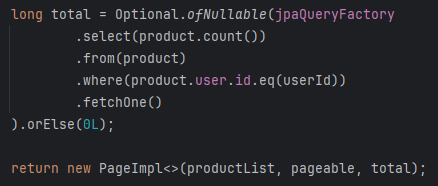
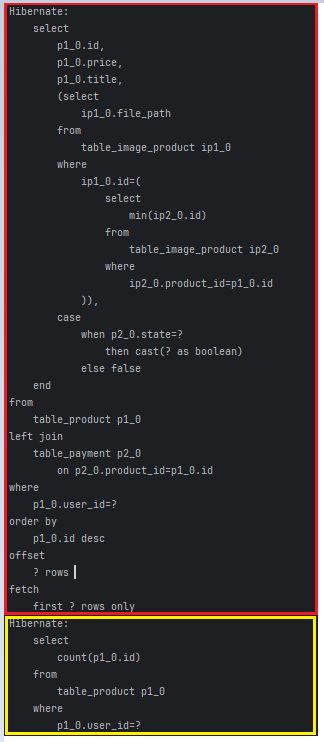
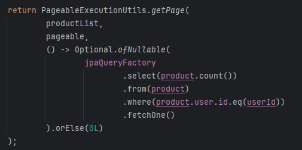
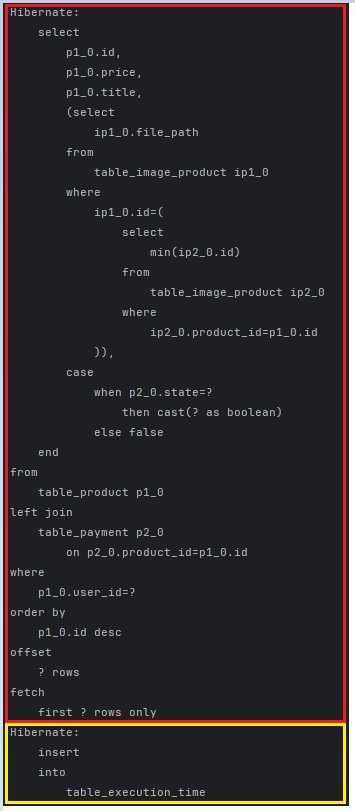

# PageableExecutionUtils.getPage()

## 목차

[문제 상황](#문제-상황)

[PageableExecutionUtils.getPage() 소개](#pageableexecutionutilsgetpage-소개)

[PageableExecutionUtils.getPage() 사용 이유](#pageableexecutionutilsgetpage-사용-이유)

[PageImpl(), PageableExecutionUtils.getPage() 쿼리 실행 비교](#pageimpl-pageableexecutionutilsgetpage-쿼리-실행-비교)

[결론](#결론)

## 문제 상황

현재 프로젝트에서는 QueryDSL을 사용해 페이징 처리를 하며, new PageImpl()을 통해 Page 객체를 반환하고 있었습니다.

QueryDSL 성능 테스트를 진행하는 과정에서 하이버네이트가 SQL 쿼리를 두 번 실행하는 문제를 발견했습니다.

이는 new PageImpl()이 본문 데이터를 조회한 후 항상 count 쿼리도 추가로 실행하기 때문입니다.

new PageImpl()은 본문 데이터 조회와 전체 데이터 수를 구하는 두 가지 쿼리를 모두 실행하므로, 불필요한 count 쿼리가 매번 발생할 수 있습니다.

이를 개선하기 위한 방법을 찾던 중, PageableExecutionUtils.getPage()라는 유틸리티 메서드를 알게 되었습니다.

## PageableExecutionUtils.getPage() 소개

PageableExecutionUtils.getPage()는 필요할 때에만 count 쿼리를 실행함으로써 불필요한 쿼리 실행을 줄이고, 성능을 최적화할 수 있도록 도와줍니다.

new PageImpl()은 항상 count 쿼리를 실행하는 반면, PageableExecutionUtils.getPage()는 페이지 크기와 데이터 상황을 고려하여 count 쿼리 실행 여부를 결정합니다.

PageableExecutionUtils.getPage()는 페이지 크기가 전체 데이터 수보다 크거나 같은 경우 count 쿼리 실행을 생략할 수 있습니다.

예를 들어, 데이터가 10개이고 페이지 크기가 10 이상일 경우 count 쿼리를 실행하지 않습니다.

## PageableExecutionUtils.getPage() 사용 이유

현재 프로젝트에서는 내가 등록한 게시글, 상품 또는 내가 찜한 상품의 데이터가 페이지 크기보다 작을 수 있으며, 상품을 판매하지 않은 유저의 경우 상점 후기가 아예 없을 수도 있습니다.

이러한 경우에는 count 쿼리를 실행하는 것이 불필요하기 때문에, PageableExecutionUtils.getPage()를 통해 쿼리 수를 줄이고 성능을 개선할 수 있습니다.

## PageImpl(), PageableExecutionUtils.getPage() 쿼리 실행 비교

### PageImpl()

- PageImpl()

  

- 하이버네이트 결과

  

  PageImpl()의 경우 빨간색 박스의 본문 데이터 조회 쿼리와 노란색 박스의 count 쿼리가 발생하는 걸 확인할 수 있습니다.

### PageableExecutionUtils.getPage()

- PageableExecutionUtils.getPage()

  

- 하이버네이트 결과

  

  PageableExecutionUtils.getPage()의 경우 빨간색 박스의 본문 데이터 조회 쿼리이후에 count 쿼리가 발생하지 않고 노란색 박스의 다른 작업을 수행하는 걸 확인할 수 있습니다.

## 결론

PageableExecutionUtils.getPage()는 QueryDSL과 함께 사용할 때, 불필요한 count 쿼리를 줄여 성능 최적화를 도울 수 있습니다.

프로젝트의 데이터 구조와 페이지 크기를 고려해 적절하게 적용하면, 쿼리 실행 횟수를 줄여서 성능을 향상시킬 수 있습니다.