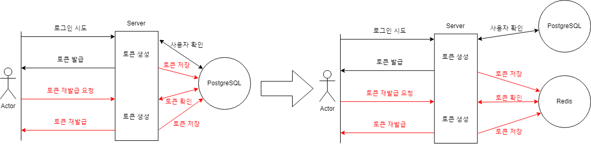

# Redis로 Refresh Token 관리하기

## 목차

[문제 정의](#문제-정의)

[개선 방법](#개선-방법)

[Refresh Token Flow](#refresh-token-flow)

## 문제 정의

최종 프로젝트에서 Access Token의 만료 기간이 30분이기 때문에 사용자는 30분 마다 토큰 재발급 요청을 보냅니다.

서버는 PostgreSQL DB에 저장된 Refresh Token을 확인하고, 일치하면 토큰을 재발급합니다.

그러나 PostgreSQL은 디스크 기반 저장소이기 때문에, Refresh Token을 조회할 때마다 디스크 I/O가 발생하여 성능 저하가 발생할 수 있습니다.

## 개선 방법

디스크 I/O 문제를 개선하기 위해 Refresh Token을 In-memory 저장소인 Redis로 관리하기로 결정했습니다.

Redis는 메모리에 직접 접근하기 때문에 Refresh Token을 조회하는 속도가 PostgreSQL을 사용하는 것보다 빠르다고 판단하였기 때문입니다. 
또한, Redis는 TTL(Time to Live) 설정을 통해 Refresh Token의 만료 시간을 설정하여 효과적으로 Refresh Token을 관리할 수 있는 장점이 있습니다.

## Refresh Token Flow

